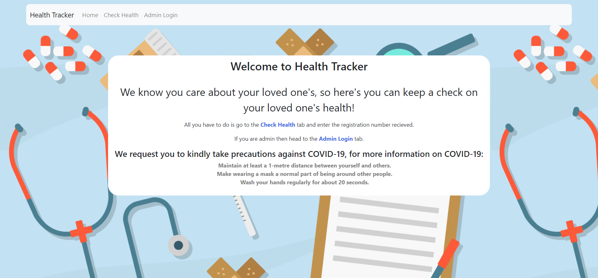
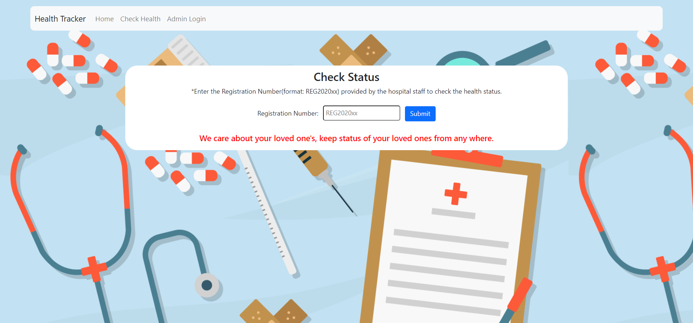
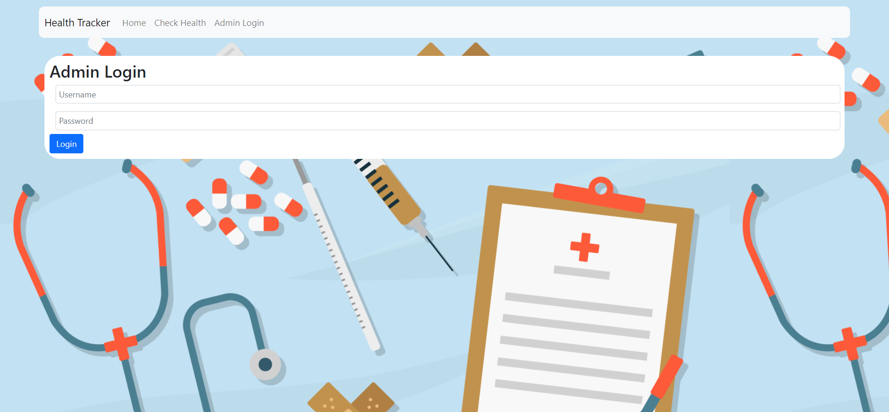
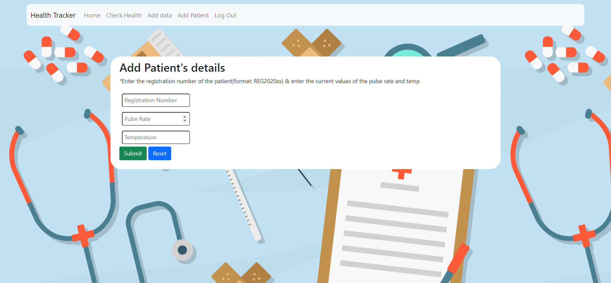
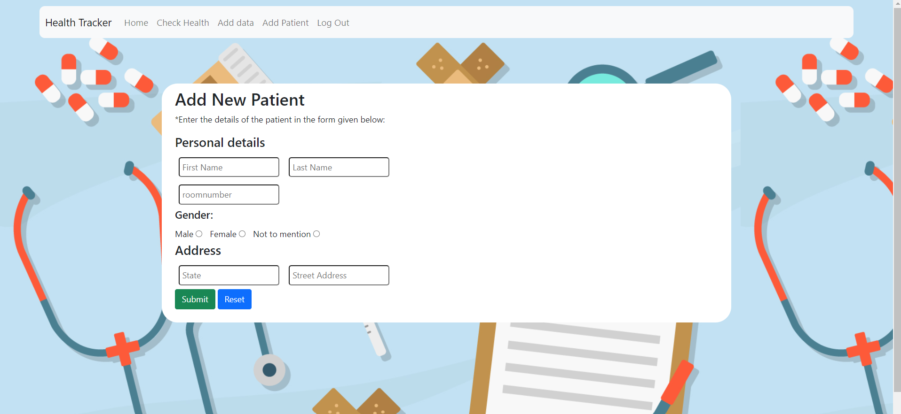

# Health-Tracker
***
### Description
This website can be used as the health tracking website of the people in hospital, and hence their relatives can track/see the condition of their loved ones from anywhere on the globe!
Basically in this website the admin(s) of the website updates the health records of the patients, this can also be automated by the IOT devices which will update the health every second but for now this is not associated with any IOT device but it can be!
For now the data is being updated manually and after each hour and on the website this data can also be visualized using the graphs which uses the past 5 records. The wesite displays the total of 10 records at a time.
Refer the screenshots below.
***
### Connect to other apps
This website can also get connected to other apps/websites using the API implemented(see the healthtracker/urls.py).
***
### Usage
##### Run the server on your local machine
``` bash
python manage.py runserver
```

##### Creating a new admin(sueruser)

```
python manage.py createsuperuser
```
***
### Screenshots(before login)




***
### Screenshots(After login)


